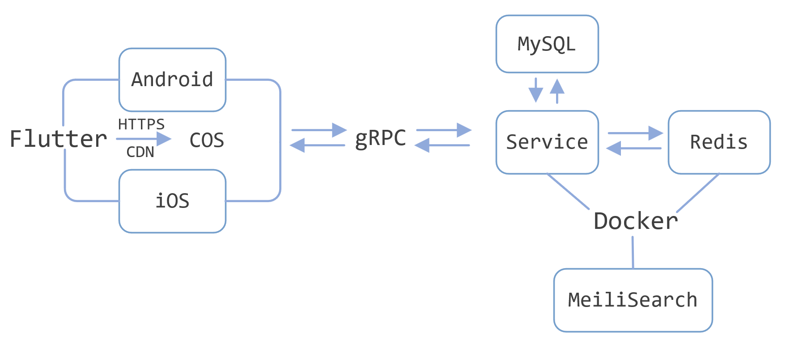

# 基于二维码的展品介绍系统

## 架构
前端 Flutter，中间件 Redis，后端 gRPC + MySQL，提供 Docker 支持

## 截图

### 开屏&登录页

|  |  |  |
| ----------- | ----------- | ----------- |
|  |  |  |
|  |
### 主页面

|  |  |  |
| ----------- | ----------- | ----------- |
|  |  |

### 展品&展览&扫码

|  |  |  |  |
| ----------- | ----------- | ----------- | ----------- |

### 用户页

|  |  |  |  |
| ----------- | ----------- | ----------- | ----------- |